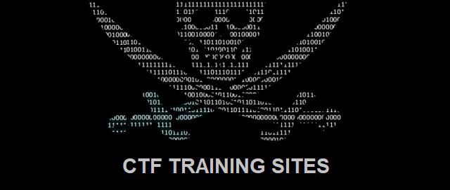

## CTF Training sites

### - [Hacker101 CTF](https://ctf.hacker101.com/)
Is a free class for web security. Whether you're a programmer with an interest in bug bounties or a seasoned security professional
### - [Pico CTF](https://picoctf.org/)
Accessible, engaging, and fun cyber security education content developed by security experts at Carnegie Mellon University.
### - [TryHackme](http://tryhackme.com/)
Is a free online platform for learning cyber security, using hands-on exercises and labs, all through your browser!
### - [Hackthebox](https://www.hackthebox.eu/)
Hack The Box is a massive, online cyber security training platform, allowing individuals, companies, universities and all kinds of organizations around the world to level up their hacking skills.
### - [CyberDefenders](https://cyberdefenders.org/)
Is a training platform focused on the defensive side of cybersecurity, aiming to provide a place for blue teams to practice
### - [CRYPTOHACK](https://cryptohack.org/)
A fun, free platform to learn about cryptography through solving challenges and cracking insecure code  
### - [CTFLearn](https://ctflearn.com/)
CTFlearn began as a simple project by the members of a local school's CTF club in order to have a playground for testing their skills.

`leonuz`
