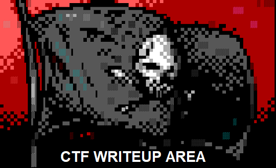

  

### **11) Deloitte Hacky Holidays 2022 - Unlock the City**  
  
>Official page: https://hackyholidays.io/  
>CTFTime Event ID: [1687](https://ctftime.org/event/1687)   
>Challenge name: SECRET CONVE.RSA.TIONS (Crypto)   
>[Writeup Link](https://leonuz.github.io/blog/SECRET-CONVE.RSA.TIONS/)  

---

### **10) BCACTF 2022**  
  
>Official page: https://bcactf.com/     
>CTFTime Event ID: [1602](https://ctftime.org/event/1602)   
>Challenge name: Jason's Tarot 3 (WEB)   
>[Writeup Link](https://leonuz.github.io/blog/Jasons-Tarot-3/)  

---

### **9) BCACTF 2022**  
  
>Official page: https://bcactf.com/   
>CTFTime Event ID: [1602](https://ctftime.org/event/1602)   
>Challenge name: Jason's Web Tarot 2 (WEB)   
>[Writeup Link](https://leonuz.github.io/blog/Jasons-Web-Tarot-2/)  

---

### **8) EZ-CTF 2022**  
  
>Official page: https://ez.ctf.cafe/    
>CTFTime Event ID: [1655](https://ctftime.org/event/1655)   
>Challenge name: Qweauty and the Beast (Crypto)   
>[Writeup Link](https://ctftime.org/writeup/33675)  

---

### **7) EZ-CTF 2022**  
  
>Official page: https://ez.ctf.cafe/    
>CTFTime Event ID: [1655](https://ctftime.org/event/1655)   
>Challenge name: I made a Blog! (WEB)   
>[Writeup Link](https://leonuz.github.io/blog/I-made-a-blog/)  

---

### **6) Nahamcon CTF 2022**  
  
>Official page: https://redteamvillage.io/ctf.html    
>CTFTime Event ID: [1630](https://ctftime.org/event/1630)   
>Challenge name: OTP Vault (Mobile)   
>[Writeup Link](https://leonuz.github.io/blog/OTP-Vault/)  

---

### **5) Midnightflag INFEKTION 2022**  
  
>Official page: https://midnightflag.fr/   
>CTFTime Event ID: [1610](https://ctftime.org/event/1610)     
>Challenge name: Exfiltration d'agent (Network)    
>[Writeup Link](https://leonuz.github.io/blog/Exfiltration-dagent/)  
  
---  

### **4) Space Heroes CTF 2022**  
  
>Official page: https://research.fit.edu/fitsec/  
>CTFTime Event ID: [1567](https://ctftime.org/event/1567)  
>Challenge name: Mysterious Broadcast (WEB)  
>[Writeup Link](https://leonuz.github.io/blog/Mysterious-Broadcast/)   
>Challenge name: The Legend of the Chozo (Forensic)  
>[Writeup Link](https://leonuz.github.io/blog/The-Legend-of-the-Chozo/)  
>Challenge name: Vader (UNINTENDED PWN)  
>[Writeup Link](https://leonuz.github.io/blog/Vader/)

---  

### **3) DEF CON 29 Red Team Village CTF Quals 2021**  
  
>Official page: https://redteamvillage.io/ctf.html  
>CTFTime Event ID: n/a  
>Challenge name: Router-Pwn (Network) 
>[Writeup Link](https://leonuz.github.io/blog/Router-Pwn/)   

---  

### **2) DownUnderCTF 2021**  
  
>Official page: https://downunderctf.com/  
>CTFTime Event ID: [1312](https://ctftime.org/event/1312)  
>Challenge name: That’s Not My Name  (RedTeam)  
>[Writeup Link](https://medium.com/@leonuz/thats-not-my-name-forensic-challenge-writeup-downunderctf-2021-cc8211b6f60b) 

---

### **1) Deloitte Hacky Holidays 2021 - Space Heroes**  
  
>Official page: https://hackyholidays.io/  
>CTFTime Event ID: [1383](https://ctftime.org/event/1383)  
>Challenge name: Knock knock knocking on shuttles door   
>[Writeup Link](https://medium.com/@leonuz/knock-knock-knocking-on-shuttles-door-challenge-writeup-hacky-holidays-space-race-2021-ctf-263bfbb5a306)  
>`Winner 2d Best Write-up` 

`leonuz`
